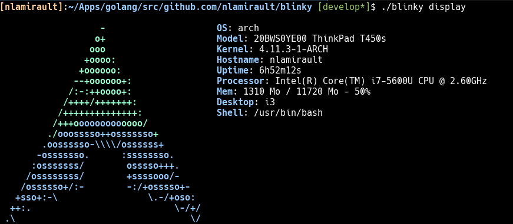
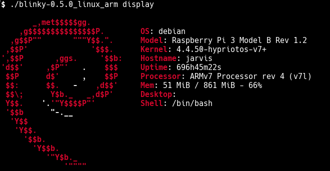

## Screenshots 




## Installation

You can download the binaries :

* Architecture i386 [ [linux](https://bintray.com/artifact/download/nlamirault/oss/blinky-0.3.0_linux_386) ]
* Architecture amd64 [ [linux](https://bintray.com/artifact/download/nlamirault/oss/blinky-0.3.0_linux_amd64) ]
* Architecture arm [ ]

## Usage

```bash
$ blinky system infos
OS: Arch Linux x86_64
Hostname: nlamirault2
Kernel: 4.2.2-1-ARCH
Memory: 5931634688/8330813440 %!d(float64=9.205463422308974)
Processor: Intel(R) Core(TM) i5-2520M CPU @ 2.50GHz
Uptime: 1445397458
```

```bash
$ blinky logo list
 List logos
 - arch
 - debian
 - mint
 - osx
 - ubuntu
 - windows
```

```bash
$ blinky logo --name="arch" display
                   -
                  o+
                 ooo
                +oooo:
               +oooooo:
              --+oooooo+:
             /:-:++oooo+:
            /++++/+++++++:
           /++++++++++++++:
          /+++ooooooooooooo/
         ./ooosssso++osssssso+
        .oossssso-\\\\/ossssss+
       -osssssso.      :ssssssso.
      :osssssss/        osssso+++.
     /ossssssss/        +ssssooo/-
    /ossssso+/:-        -:/+osssso+-
   +sso+:-\                 \.-/+oso:
  ++:.                           \-/+/
 .\                                 \/
```


```bash
$ blinky display

                   -                     OS: Arch Linux x86_64
                  o+                     Kernel: 4.2.2-1-ARCH
                 ooo                     Hostname: nlamirault2
                +oooo:                   Uptime: 1445397458
               +oooooo:                  Processor: Intel(R) Core(TM) i5-2520M CPU @ 2.50GHz
              --+oooooo+:                Mem: 5930680320/8330813440 %!d(float64=9.210920944593857)
             /:-:++oooo+:
            /++++/+++++++:
           /++++++++++++++:
          /+++ooooooooooooo/
         ./ooosssso++osssssso+
        .oossssso-\\\\/ossssss+
       -osssssso.      :ssssssso.
      :osssssss/        osssso+++.
     /ossssssss/        +ssssooo/-
    /ossssso+/:-        -:/+osssso+-
   +sso+:-\                 \.-/+oso:
  ++:.                           \-/+/
 .\                                 \/

```

## Contributing

See [here](CONTRIBUTING.md)


## Changelog

A [ChangeLog](ChangeLog.md) is available.


## License

See [LICENSE](LICENSE) for the complete license..


## Contact

[Blinky]: https://github.com/nlamirault/blinky
[COPYING]: https://github.com/nlamirault/blinky/blob/master/COPYING
[Issue tracker]: https://github.com/nlamirault/blinky/issues
